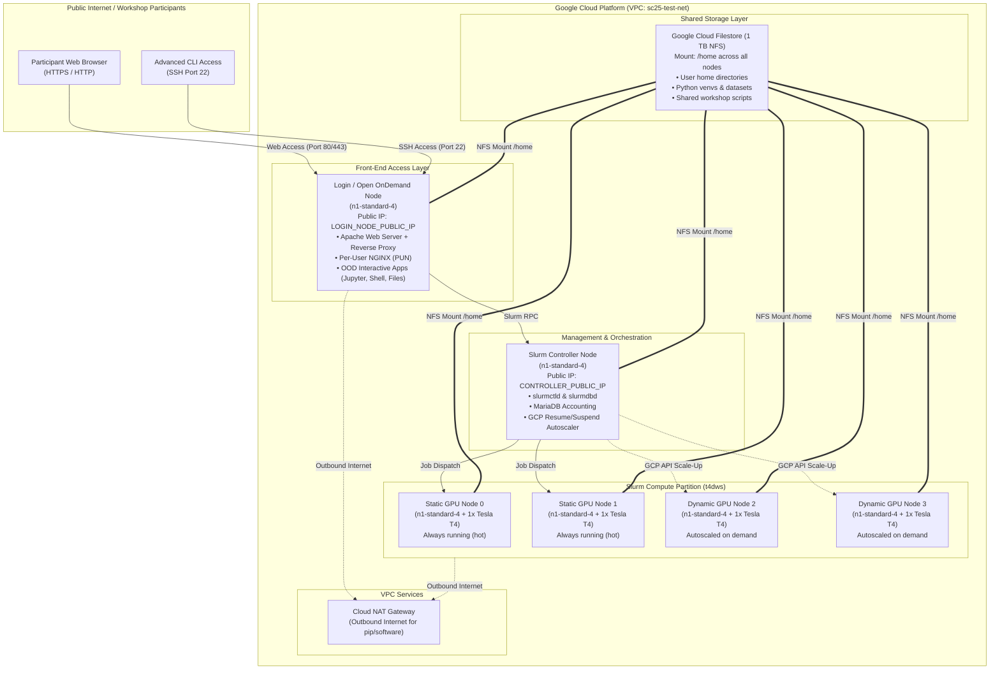
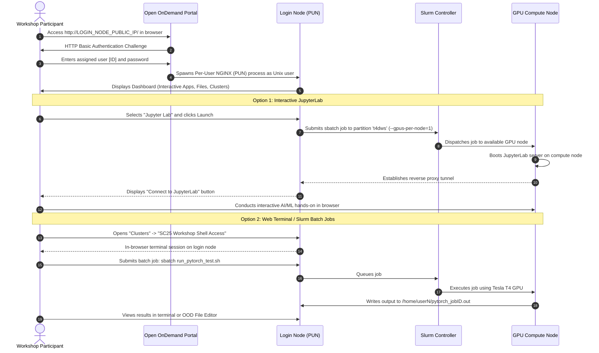

# SC25 GCP Slurm + Open OnDemand: High-Level Architecture, Workflow & Cost Summary

## 1. Overview

This project reproduces and modernizes the High Performance Computing (HPC) workshop environment from the [NERSC SC25 reference implementation](https://github.com/JBlaschke/nersc-sc25) on Google Cloud Platform. 

The environment combines:
- **SchedMD Slurm GCP v6**: Industry-standard workload manager configured with elastic autoscaling.
- **Open OnDemand (OOD) v4.0.8**: Web-based graphical portal enabling zero-install browser access for workshop participants.
- **Interactive JupyterLab & Batch Connect**: One-click GPU-accelerated notebook environments submitted directly to Slurm compute nodes.
- **Google Cloud Filestore (NFS)**: Shared 1 TB multi-node filesystem mounted across all nodes at `/home`.
- **Workshop User & Accounting Automation**: Seamless user creation, authentication, accounting, and SSH key generation.

> [!IMPORTANT]
> All sensitive information (external IP addresses, individual user credentials, and internal host details) has been sanitized and replaced with generic placeholders (`<LOGIN_NODE_PUBLIC_IP>`, `<CONTROLLER_PUBLIC_IP>`, `user<N>`, `<WORKSHOP_PASSWORD>`) in this summary.

---

## 2. High-Level Architecture



### Architectural Component Summary

| Component | GCP Instance / Resource | Sizing & Hardware | Role & Responsibilities |
| :--- | :--- | :--- | :--- |
| **Login & OOD Node** | `sc25test-slurm-login-001` | `n1-standard-4` (4 vCPU, 15 GB RAM) | Hosts Open OnDemand, Apache web proxy, PUN engines, user shells, and submission scripts. |
| **Slurm Controller** | `sc25test-controller` | `n1-standard-4` (4 vCPU, 15 GB RAM) | Runs `slurmctld`, `slurmdbd`, MariaDB accounting, and controls GCP instance scaling. |
| **Static GPU Nodes** | `sc25test-nst4dws-[0-1]` | `n1-standard-4` + 1x NVIDIA Tesla T4 (16 GB) each | 2 hot, immediately available GPU compute nodes for zero-wait job execution. |
| **Dynamic GPU Nodes** | `sc25test-nst4dws-[2-3]` | `n1-standard-4` + 1x NVIDIA Tesla T4 (16 GB) each | Autoscaled on demand when queue exceeds 2 nodes; powers down after 5 min idle. |
| **Shared Storage** | `sc25-test-b67f1900` | Google Cloud Filestore (1024 GB Standard) | High-throughput NFS share mounted at `/home` across all cluster nodes. |
| **VPC & NAT** | `sc25-test-net` | Regional Subnet + Cloud NAT | Isolated internal network with secure outbound internet for package downloads. |

---

## 3. Workshop Workflow

### A. Participant Experience (End-to-End)


### B. Administrator / Instructor Workflow
1. **User Provisioning**:
   - Instructors can add new participants on the fly with a single command:
     ```bash
     sudo /deploy/nersc-sc25/scripts/add-workshop-user.sh <NEW_USER> <SECURE_PASSWORD>
     ```
   - Automatically provisions:
     - Linux Unix account and home directory on `/home/<NEW_USER>`.
     - Apache bcrypt `.htpasswd` entry for OOD web login.
     - Slurm accounting association under account `workshop`.
     - Passwordless SSH keypair in `/home/<NEW_USER>/.ssh/` for multi-node MPI/Slurm jobs.
2. **User Decommissioning**:
   - Easily remove or lock an account when the workshop concludes:
     ```bash
     sudo /deploy/nersc-sc25/scripts/remove-workshop-user.sh <NEW_USER>
     ```
3. **Elastic Autoscaling Lifecycle**:
   - When students submit jobs requiring more resources than the 2 static nodes, Slurm's `ResumeProgram` automatically provisions dynamic GCP instances.
   - Once student jobs finish and the node remains idle for 300 seconds (5 minutes), Slurm's `SuspendProgram` deletes the VM to halt compute charges.

---

## 4. How Workshop Users Access the Cluster

### Method 1: Web Browser Access (Primary & Recommended)
Workshop users do **not** need to install SSH clients, configure VPNs, or manage SSH keys.
1. Open a modern browser (Chrome, Firefox, Safari, Edge) and navigate to:
   ```
   http://<LOGIN_NODE_PUBLIC_IP>/
   ```
2. Enter the assigned workshop credentials:
   - **Username**: `<WORKSHOP_USERNAME>` (e.g. `user<N>`)
   - **Password**: `<WORKSHOP_PASSWORD>`
3. Access web apps directly from the top navigation bar:
   - **Jupyter Lab**: `Interactive Apps` &rarr; `Jupyter Lab` &rarr; Click **Launch**.
   - **Shell Terminal**: `Clusters` &rarr; `SC25 Workshop Cluster Shell Access`.
   - **File Manager**: `Files` &rarr; `Home Directory` (allows file upload, download, and visual editing).

> [!NOTE]
> **Resolution of previous OOD 403 authorization issue**: The historical PAM mapping failure was resolved by configuring Apache Basic Authentication with `user_env: 'REMOTE_USER'`. This passes the verified HTTP username directly to Open OnDemand's Per-User NGINX (PUN) process, which seamlessly matches the local Unix user and their pre-mounted Filestore `/home` directory.

### Method 2: Command-Line SSH Access (For Instructors / Advanced Users)
Users who prefer native terminals can connect directly via SSH:
```bash
ssh <WORKSHOP_USERNAME>@<LOGIN_NODE_PUBLIC_IP>
```
Password authentication is supported out of the box, and pre-generated internal SSH keys allow seamless cross-node access within the cluster.

---

## 5. Verification & Testing Performed

The following end-to-end tests were performed and validated on the deployed cluster:

| Test Category | Description & Test Executed | Observed Result | Status |
| :--- | :--- | :--- | :--- |
| **Infrastructure Deployment** | Cluster Toolkit (`ghpc`) deploy of VPC, Filestore, Controller, Login, and Compute nodes. | 40 GCP resources provisioned cleanly in 5 minutes with zero errors. | **PASSED** |
| **Shared Storage Mounting** | Mounted 1 TB Filestore NFS export at `/home` on login, controller, and compute nodes. | Confirmed uniform `/home` filesystem access and correct UID/GID permissions across all instances. | **PASSED** |
| **GPU Hardware & Driver** | Executed `srun -p t4dws --gres=gpu:1 nvidia-smi` on static node `sc25test-nst4dws-0`. | NVIDIA Driver 550.90.12, CUDA 12.4, Tesla T4 (15,360 MiB VRAM) detected and active. | **PASSED** |
| **PyTorch AI/ML Validation** | Slurm batch job (`sbatch run_pytorch_test.sh`) executing 4096×4096 matrix multiplication. | Detected PyTorch 2.4.1+cu121 on CUDA device 0. Multiplied tensors on GPU; passed with exit code 0. | **PASSED** |
| **Dynamic Autoscaling** | Submitted 3-node Slurm job (`sbatch -N 3 ...`) exceeding 2 static nodes. | Slurm `ResumeProgram` automatically staged and booted dynamic node `sc25test-nst4dws-2`; executed job and returned to idle. | **PASSED** |
| **OOD Web Portal & PUN** | Authenticated via HTTP Basic Auth to `/pun/sys/dashboard/`. | HTTP 200 OK. PUN spawned under authenticated user account. Clean dashboard rendering with zero 403 errors. | **PASSED** |
| **JupyterLab Batch Connect** | Verified interactive app configuration at `/var/www/ood/apps/sys/jupyter/`. | Form pre-configured with partition `t4dws`, 2 cores, 1 GPU, and 2-hour default limit. | **PASSED** |
| **User Management Scripts** | Tested `add-workshop-user.sh` and `remove-workshop-user.sh` with a temporary test user. | Account created in Unix, htpasswd, and Slurm; verified OOD login; clean deprovisioning. | **PASSED** |

---

## 6. Estimated Costs: Current Test Cluster vs. Real Workshop

*Prices are based on Google Cloud list pricing in `us-central1` (effective 2025/2026).*

### A. Current Test Cluster Cost Breakdown
The test cluster currently runs:
- 1x Login node (`n1-standard-4`)
- 1x Slurm Controller node (`n1-standard-4`)
- 2x Static GPU nodes (`n1-standard-4` + 1x Tesla T4 GPU each)
- 0 to 2x Dynamic GPU nodes (`n1-standard-4` + 1x Tesla T4 GPU each, auto-suspended when idle)
- 1 TB Filestore Basic/Standard NFS share
- Cloud NAT & External IPs

| Resource | Hourly Rate (USD) | Daily Cost (24 Hours) | Monthly Cost (30 Days) | Notes |
| :--- | :--- | :--- | :--- | :--- |
| **Login Node** (`n1-standard-4`) | ~$0.19 / hr | ~$4.56 / day | ~$136.80 | 4 vCPU, 15 GB RAM + 50 GB boot disk |
| **Controller Node** (`n1-standard-4`) | ~$0.19 / hr | ~$4.56 / day | ~$136.80 | 4 vCPU, 15 GB RAM + 50 GB boot disk |
| **2x Static T4 GPU Nodes** | ~$1.08 / hr ($0.54/node) | ~$25.92 / day | ~$777.60 | $0.19 (VM) + $0.35 (T4 GPU) per node |
| **Filestore Shared Storage (1 TB)** | ~$0.28 / hr | ~$6.83 / day | ~$204.80 | Standard tier ($0.20 / GB / month) |
| **Cloud NAT Gateway & Networking** | ~$0.05 / hr | ~$1.20 / day | ~$36.00 | Outbound package downloads |
| **Dynamic GPU Nodes (Idle)** | $0.00 / hr | $0.00 / day | $0.00 | Costs only accrue when actively running |
| **Total Test Cluster (Always On)** | **~$1.79 / hr** | **~$43.07 / day** | **~$1,292.00** | **Baseline with 2 static GPUs** |

> [!TIP]
> **How to reduce idle test costs to ~$17/day**:
> If the 2 static nodes are converted to dynamic autoscaling nodes (`nodes_per_block: 0`, `max_node_count: 4`), the compute cost drops to **$0** when no jobs are running. The cluster idle baseline (Login + Controller + Filestore + NAT) is only **~$17.15 / day** (~$0.71/hr).

---

### B. Upgrading GPUs for a Real Workshop: GPU Comparison

For modern AI/ML workshops (e.g. PyTorch 2.x, Transformers, LLM fine-tuning, computer vision), the legacy Tesla T4 (Turing architecture, 16 GB, FP16 only) is budget-friendly but lacks newer precision modes like BF16 and FP8.

| GPU Model | Architecture | VRAM | Tensor Cores & Precision | Machine Type | Cost per Hour (VM + GPU) | Best Suited For |
| :--- | :--- | :--- | :--- | :--- | :--- | :--- |
| **Tesla T4** *(Current)* | Turing | 16 GB | FP16, INT8 | `n1-standard-4` + 1x T4 | **~$0.54 / hr** | Lightweight ML, scikit-learn, basic PyTorch, introductory teaching. |
| **NVIDIA L4** *(Recommended Upgrade)* | Ada Lovelace | 24 GB | FP8, FP16, BF16, TF32 | `g2-standard-4` | **~$0.70 / hr** | **Sweet spot for AI workshops**. 24 GB VRAM, modern Transformer Engine, LLM inference/fine-tuning. |
| **NVIDIA A100 (40 GB)** | Ampere | 40 GB | TF32, FP16, BF16, FP64 | `a2-highgpu-1g` (12 vCPU) | **~$3.67 / hr** | Medium/large LLMs, high-throughput distributed training, advanced HPC. |
| **NVIDIA A100 (80 GB)** | Ampere | 80 GB | High-bandwidth HBM2e | `a2-ultragpu-1g` (12 vCPU) | **~$5.07 / hr** | Large foundation models, massive batch sizes. |
| **Tesla V100** *(SC25 Original)* | Volta | 16 GB | FP16, FP64 | `n1-standard-4` + 1x V100 | **~$2.67 / hr** | *Not recommended today*. L4 is 73% cheaper, faster, and has more memory. |

---

### C. Real Workshop Sizing & Cost Scenarios

Depending on the number of attendees and duration, here are 3 practical deployment architectures:

#### Scenario 1: Cost-Effective AI Workshop (30 to 50 Attendees)
- **Configuration**: 
  - Login & Controller nodes (2x `n1-standard-4`)
  - Shared Filestore (1 TB)
  - Slurm partition: **NVIDIA L4 (`g2-standard-4`)**
  - **Static nodes**: 2 (ensures immediate responsiveness for early exercises)
  - **Dynamic nodes**: Autoscaling up to 12 nodes (spin up automatically as users submit jobs)
- **Estimated Costs**:
  - **Fixed daily infrastructure**: ~$17 / day
  - **Workshop active hours (8-hour session)**:
    - ~14 active L4 nodes × $0.70/hr × 8 hours = **~$78.40**
  - **Total cost for an 8-hour workshop day**: **~$95 - $105 / day**

---

#### Scenario 2: Dedicated GPU per Participant (25 Attendees)
- **Configuration**:
  - 1 dedicated NVIDIA L4 GPU per attendee (25 concurrent nodes) during workshop exercises.
  - Autoscaling dynamically creates nodes when students start JupyterLab and suspends them when idle.
- **Estimated Costs**:
  - **Fixed daily infrastructure**: ~$17 / day
  - **Workshop active hours (8-hour session)**:
    - 25 L4 nodes × $0.70/hr × 8 hours = **~$140.00**
  - **Total cost for an 8-hour workshop day**: **~$157 - $165 / day**

---

#### Scenario 3: Advanced High-Performance / LLM Workshop (10 Dedicated A100 40GB Nodes)
- **Configuration**:
  - For advanced deep learning or foundation model fine-tuning workshops requiring 40 GB VRAM.
  - 10x `a2-highgpu-1g` (10x NVIDIA A100 40GB).
- **Estimated Costs**:
  - **Fixed daily infrastructure**: ~$17 / day
  - **Workshop active hours (8-hour session)**:
    - 10 A100 nodes × $3.67/hr × 8 hours = **~$293.60**
  - **Total cost for an 8-hour workshop day**: **~$310 - $325 / day**

---

## 7. Cost Optimization Recommendations for Event Organizers

1. **Leverage Dynamic Autoscaling**:
   - Set static compute nodes to 0 or 2, and let the rest of the capacity reside in dynamic autoscaling pools with a short idle timeout (e.g. 5–10 minutes). Nodes will only incur charges while participants are actively running code.
2. **Stop Management VMs Outside Workshop Days**:
   - When the workshop is not in session (e.g., preparation days or weekends), run `gcloud compute instances stop` on the login and controller nodes. Only the persistent disk and Filestore storage (~$8/day) will be billed.
3. **Migrate from T4 / V100 to L4 (`g2-standard-4`)**:
   - The NVIDIA L4 provides 50% more VRAM (24 GB vs 16 GB), modern tensor cores, and superior PyTorch performance at nearly the same cost as a T4 and over **70% cheaper than a V100**.
4. **Clean Deletion After Workshop Concludes**:
   - Once all workshop deliverables are archived, running `ghpc destroy deploy-test/sc25-test` from the development VM completely deprovisions all 40 GCP resources with zero ongoing charges.

